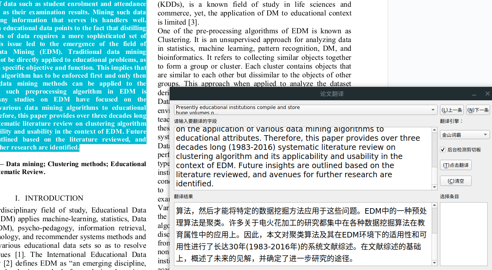

# Paper-translator 论文翻译小助手
	
Automatic translation of Chinese and English papers

自动翻译中英文论文，复制即可翻译



## 使用说明

1. 首先需要安装python，推荐使用[anaconda][1]，因为PyQt5需要python3的支持，请选择python3版本的anaconda
2. 安装完python后，利用python自带的包管理工具pip安装所需依赖PyQt5和requests，以及pyexecjs（可选，谷歌翻译需要）
```bash
pip install pyqt5 requests pyexecjs
```
3. 完成后运行目录下的py脚本即可
```bash
python paperTran.py
```

## 小建议
- 软件会自动去掉所有的换行符，建议翻译时按段落选择，一段段的翻译
- 网络不好时软件可能会卡住，没网时无法使用


## 功能
- 检测剪切板，实时翻译
- 自动替换论文中的换行符、合并多个空格
- 对英文选择后，右下小窗口会出现选择英文的解释
- 翻译的句子会以json格式保存在当前目录下translated.json文件中
- 自动置顶
- 添加快捷键：Alt+t翻译，Alt+c清空
- 添加ico
- 保存历史记录，可以上下切换
- 有道翻译、金山词霸、谷歌翻译三种翻译引擎

## BUG修复
1. bug: 在编辑器中选择文本会卡死。解决方案：利用QApplication.clipboard替换pyperclip

## Requirement
Based on PyQt5, python3, pyexecjs(google translate need)

install by pip just like:
```bash
pip install clipboard pyqt5 pyexecjs
```

## How to run
run:
```bash
python paperTran.py
```

## Features
- detect clipboard
- auto replace ‘\n’
- explain the choice 
- saved translated sentences in translated.json file
- auto top
- add shortcuts

[1]: https://www.anaconda.com/download/