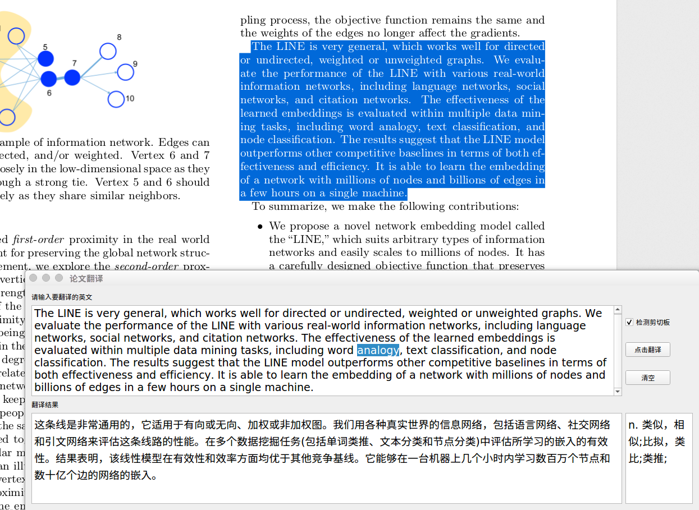

# Paper-translate 论文翻译小助手
	
Automatic translation of Chinese and English papers

自动翻译中英文论文，复制即可翻译



## 使用说明

1. 首先需要安装python，推荐使用[anaconda][1]，因为PyQt5需要python3的支持，请选择python3版本的anaconda
2. 安装完python后，利用python自带的包管理工具pip安装所需依赖
```bash
pip install clipboard pyqt5
```
3. 完成后运行目录下的py脚本即可
```bash
python paperTran.py
```

## 功能
- 检测剪切板，实时翻译
- 自动替换论文中的换行符
- 对英文选择后，右下小窗口会出现选择英文的解释
- 翻译的句子会以json格式保存在当前目录下translated.json文件中
- 自动置顶
- 添加快捷键


## Requirement
Based on PyQt5, python3

install by pip just like:
```bash
pip install clipboard pyqt5
```

## How to run
run:
```bash
python paperTran.py
```

## Features
- detect clipboard
- auto replace ‘\n’
- explain the choice 
- saved translated sentences in translated.json file
- auto top
- add shortcuts

[1]: https://www.anaconda.com/download/