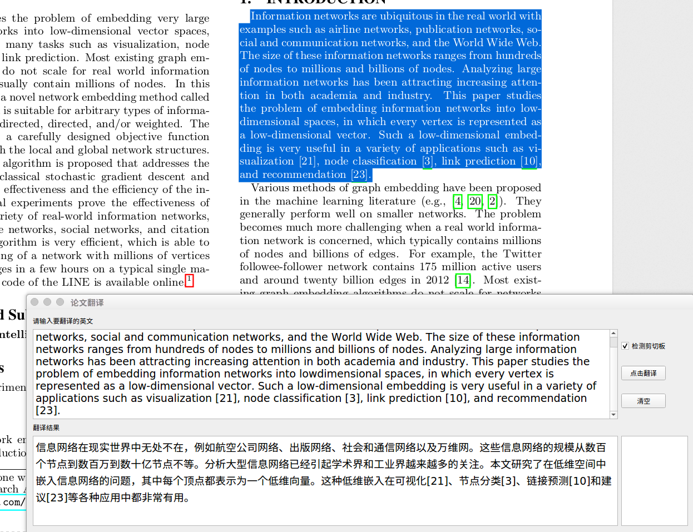

# Paper-translation 论文翻译小助手
	
Automatic translation of Chinese and English papers
自动翻译中英文论文
复制即可翻译

## requirement
Based on PyQt5, python3

install by pip just like:
```bash
pip install clipboard pyqt5
```

需要PyQt5, python3的支持，利用pip安装即可

## how to run
run:
```bash
python paperTran.py
```

## features
- detect clipboard
- auto replace ‘\n’



- 检测剪切板
- 自动替换论文中的换行符